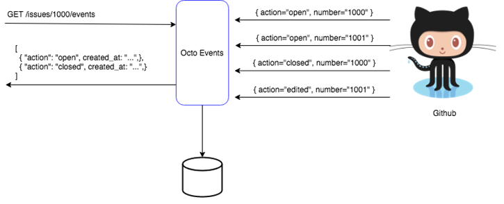
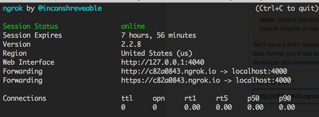
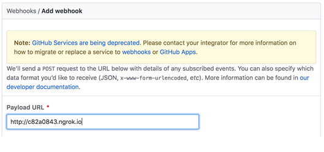

# Octo Events

Octo Events is an application that listens to Github Events via webhooks and expose by an api for later use.



 The test consists in building 2 endpoints:

## 1. Webhook Endpoint

The Webhook endpoint receives events from Github and saves them on the database, in order to do that you must read the following docs:

* Webhooks Overview: https://developer.github.com/webhooks/ 
* Creating Webhooks : https://developer.github.com/webhooks/creating/

It must be called `/events`

## 2. Events Endpoint

The Events endpoint will expose the persist the events by an api that will filter by issue number

**Request:**

> GET /issues/1000/events

**Response:**

> 200 OK
```javascript
[ 
  { "action": "open", created_at: "...",}, 
  { "action": "closed", created_at: "...",} 
]
```

**Github Integration Instructions**

* Tip: You can use ngrok (https://ngrok.com/)  to install / debug the webhook calls, it generates a public url that will route to your local host:

   $ sudo ngrok http 4000 



   GitHub


 
**Final Observations**

* Use any library / framework / gem  you want, you don't have to do anything "from scratch"
* Write tests, use your favorite framework for that
* Use Postgres 9.6 or MySQL 5.7 as database;
* Add to README.md your instructions for running the project. Whether you're delivering just source code or an accompanying `Dockerfile`/`docker-compose.yml`, we expect at most the following commands to be needed to run your solution (besides the usual docker related deploy steps):
    - `rake db:create`
    - `rake db:migrate`
    - `rails s -p 3000 -b '0.0.0.0'`
* We'll run your code with Ruby 2.5.1;
* Success and have fun :-)